# Ubuntu answer file, one screen at a time

What does the Ubuntu Server installer need to be told before it installs on
its own? This page starts with no answer file, boots, and looks at the first
screen the installer stops on. The next boot gets an answer file with one
more entry: the answer to that screen. That repeats until the install runs
to the end by itself. Then the file is cut down to the lines that are really
needed, and each of those lines is taken out once more to prove it is needed.

Every answer is what pressing <kbd>Enter</kbd> on the screen gives (the
default), with these exceptions:

- profile: server name `ubuntu`, user name `ubuntu`, password `ubuntu|123`;
- storage: the whole disk, **without** LVM;
- SSH: *Install OpenSSH server* ticked.

Every boot is real and starts from a new blank 20 GiB disk: a UEFI
QEMU/KVM machine (2 GiB of RAM, virtio NIC) PXE-boots through isoboot, iPXE
loads the ISO's kernel and initrd over HTTP, and the installer runs from the
ISO tree over NFS. The release is Ubuntu 26.04.1 LTS (installer: subiquity
snap revision 7403) unless a section says otherwise. Every screenshot is the
machine's real 3840x2160 screen; click a thumbnail for the full image.

- [The answer file and preseed: two different channels](#the-answer-file-and-preseed-two-different-channels)
- [How the installer decides whether to ask](#how-the-installer-decides-whether-to-ask)
- [The journey on Ubuntu 26.04.1](#the-journey-on-ubuntu-26041)
- [The "Continue with autoinstall?" question](#the-continue-with-autoinstall-question)
- [The final minimal answer file](#the-final-minimal-answer-file)
- [Every line is needed: ablation](#every-line-is-needed-ablation)
- [systemctl get-default: 24.04 and 26.04](#systemctl-get-default-2404-and-2604)
- [The 4K screen](#the-4k-screen)
- [How to reproduce](#how-to-reproduce)
- [What surprised us](#what-surprised-us)
- [Appendix: writing the file top-down instead](#appendix-writing-the-file-top-down-instead)

## The answer file and preseed: two different channels

Ubuntu's live server installer can be told things in two ways, and they
answer different questions.

| | Debconf preseed | Autoinstall answer file |
|---|---|---|
| Read by | casper, the live system's initrd, before the installer starts (`scripts/casper-bottom/24preseed`, `14locales`, `19keyboard`) | subiquity, the installer |
| Comes from | the kernel command line: `preseed/file=` or `file=` (a file on the boot medium), `preseed/url=` or `url=` (fetched; a `url=` ending in `.iso` is the ISO download instead), any `question/name=value` pair, `locale=`, `preseed/early_command=` | cloud-init's NoCloud seed: `user-data` with an `autoinstall:` section. isoboot's httpd serves it from the Provision's `ProvisionAutomation` (`ds=nocloud;s=<URL>/`) |
| Sets | debconf values and settings of the **live** system, for example its locale and console keyboard | the installer's screens: every answer, and which screens still ask |

So preseed is not ignored on Ubuntu: casper applies it to the live system.
But the screens belong to subiquity, and subiquity skips a screen only
because of the answer file. Two boots without an answer file show it:

- **`locale=fr_FR.UTF-8`** on the kernel line, no answer file: casper sets
  the live system's locale (*Setting up locales... Generating locales*). The language
  screen is still shown, now in French and with *Français* highlighted. The
  preseed preselects; it does not answer.

  [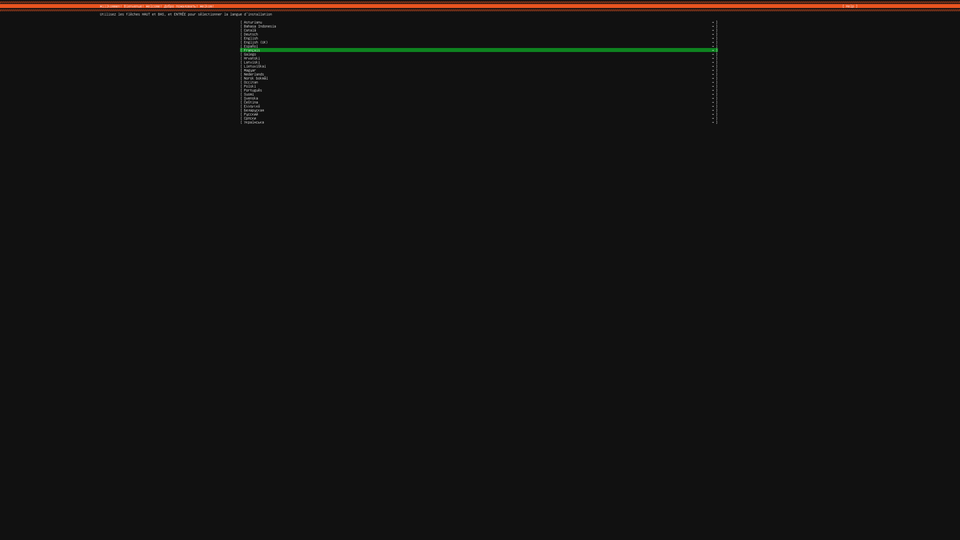](ubuntu-autoinstall-journey/preseed1-locale-fr.png) <sub>[text at 100%](ubuntu-autoinstall-journey/preseed1-locale-fr-crop.png)</sub>

- **`keyboard-configuration/layoutcode=fr`** (a debconf `question=value`
  pair), no answer file: casper sets the console keyboard (*Setting up
  console keyboard... done*). The language screen is shown as before; after
  <kbd>Enter</kbd> on *English* the keyboard screen still offers
  *English (US)*. subiquity suggests the layout that goes with the chosen
  language and falls back to the live system's `/etc/default/keyboard` only
  for languages without a suggestion.

  [](ubuntu-autoinstall-journey/preseed2-language.png) <sub>[text at 100%](ubuntu-autoinstall-journey/preseed2-language-crop.png)</sub>
  [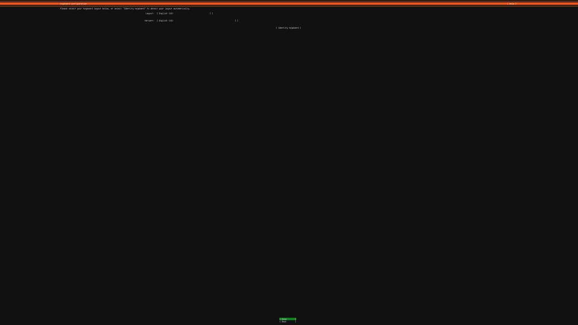](ubuntu-autoinstall-journey/preseed2-keyboard.png) <sub>[text at 100%](ubuntu-autoinstall-journey/preseed2-keyboard-crop.png)</sub>

Neither boot removed a screen. The rest of this page is about the answer
file.

## How the installer decides whether to ask

Read in subiquity's source (the 26.04.1 installer snap) and seen on the boots
below:

- **No answer file:** fully interactive. Every screen is shown.
- **Answer file present** (an `autoinstall:` section in the user-data): the
  install is unattended. Each section the file does not give takes its
  default, and nothing is asked. One exception: the user (`identity`) has no
  default, and a missing one stops the install with *neither identity nor
  user-data provided*.
- **`interactive-sections`** names the screens that are still shown although
  an answer file is present. With a non-empty list the install is
  interactive again, and a listed `identity` need not be in the file.
- **Without the `autoinstall` kernel argument** an unattended install first
  asks *Continue with autoinstall? (yes|no)* on the console. That question is
  answered on the kernel command line, not in the file (see
  [below](#the-continue-with-autoinstall-question)).

So "answer one screen and keep the rest" means: answer that screen in the
file, and list every screen not answered yet in `interactive-sections`. The
server installer's screens, in order, with the section that answers each:

| Screen | Section |
|---|---|
| Language | `locale` |
| Installer update available (only when there is one) | `refresh-installer` |
| Keyboard configuration | `keyboard` |
| Choose the type of installation | `source` |
| Network configuration | `network` |
| Proxy configuration | `proxy` |
| Ubuntu archive mirror configuration | `apt` |
| Guided storage configuration | `storage` |
| Profile configuration | `identity` |
| Upgrade to Ubuntu Pro | `ubuntu-pro` |
| SSH configuration | `ssh` |
| Third-party drivers | `drivers` |
| Featured server snaps | `snaps` |

The network screen is accepted as detected by taking `network` off the list.
The file never gets a `network:` section here: the installer runs from an NFS
root over the boot NIC, and reconfiguring that NIC can freeze the install.

## The journey on Ubuntu 26.04.1

Each step shows the whole answer file served as `user-data` (`meta-data` is
an empty file). Lines new in that step end in `# <- added`; entries taken
out are listed under the file. Kernel arguments are those of
[`examples/ubuntu-26.04.yaml`](../examples/ubuntu-26.04.yaml) unless a step
says otherwise:

```
console=ttyS0,115200 ip=dhcp netboot=nfs nfsroot={{.NFSRoot}} fsck.mode=skip autoinstall ds=nocloud;s={{.ProvisionAutomationBaseURL}}/ ---
```

### Step 0: no answer file

Kernel arguments without `autoinstall` and without `ds=...`
(`console=ttyS0,115200 ip=dhcp netboot=nfs nfsroot={{.NFSRoot}} fsck.mode=skip ---`);
nothing is served.

**Outcome:** the language screen, *Willkommen! Bienvenue! Welcome!* with
*English* highlighted. Without an answer file every screen asks. (The serial
console shows its own first screen at the same time: *Continue in rich mode*
/ *Continue in basic mode* / *View SSH instructions*.)

[](ubuntu-autoinstall-journey/step00-language.png) <sub>[text at 100%](ubuntu-autoinstall-journey/step00-language-crop.png)</sub>

### Step 1: answer the language screen

The smallest answer file that answers the language screen (`locale`) and keeps every later screen: `#cloud-config`, `autoinstall:`, `version: 1` (required), `interactive-sections` with all later screens, and the answer `locale: en_US.UTF-8` (what <kbd>Enter</kbd> on *English* gives).

```yaml
#cloud-config
autoinstall:
  version: 1
  interactive-sections:
    - refresh-installer
    - keyboard
    - source
    - network
    - proxy
    - apt
    - storage
    - identity
    - ubuntu-pro
    - ssh
    - drivers
    - snaps
  locale: en_US.UTF-8
```

**Outcome:** The language screen is gone. The installer stops on **Keyboard configuration**: Layout *English (US)*, Variant *English (US)*. No installer-update screen came first: it is shown only when a newer installer is available.

[](ubuntu-autoinstall-journey/step01-keyboard.png) <sub>[text at 100%](ubuntu-autoinstall-journey/step01-keyboard-crop.png)</sub>

### Step 2: answer the keyboard screen

`keyboard` leaves the list; its answer is the screen's default, layout `us`.

```yaml
#cloud-config
autoinstall:
  version: 1
  interactive-sections:
    - refresh-installer
    - source
    - network
    - proxy
    - apt
    - storage
    - identity
    - ubuntu-pro
    - ssh
    - drivers
    - snaps
  locale: en_US.UTF-8
  keyboard:              # <- added
    layout: us           # <- added
```

Removed: `- keyboard`

**Outcome:** Stops on **Choose the type of installation**: `(X) Ubuntu Server` and `[X] Search for third-party drivers`, both selected by default.

[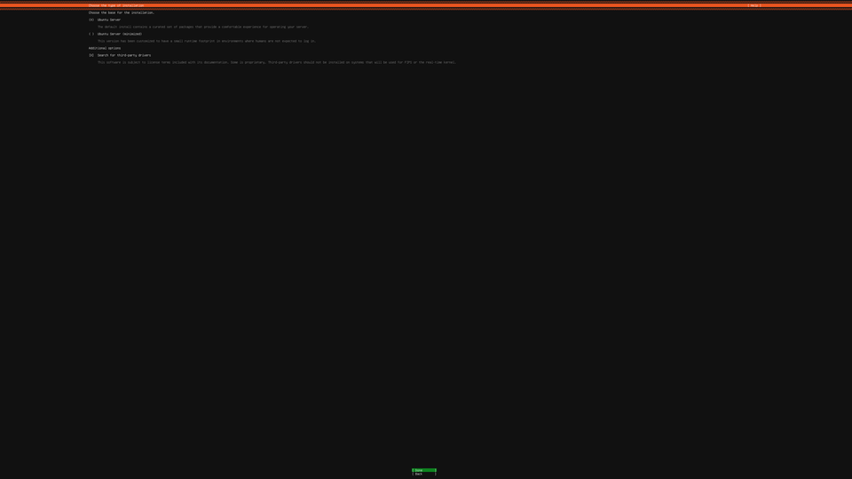](ubuntu-autoinstall-journey/step02-source.png) <sub>[text at 100%](ubuntu-autoinstall-journey/step02-source-crop.png)</sub>

### Step 3: answer the installation type screen

`source` leaves the list; its answer is the screen as shown: Ubuntu Server, driver search on.

```yaml
#cloud-config
autoinstall:
  version: 1
  interactive-sections:
    - refresh-installer
    - network
    - proxy
    - apt
    - storage
    - identity
    - ubuntu-pro
    - ssh
    - drivers
    - snaps
  locale: en_US.UTF-8
  keyboard:
    layout: us
  source:                 # <- added
    id: ubuntu-server     # <- added
    search_drivers: true  # <- added
```

Removed: `- source`

**Outcome:** Stops on **Network configuration**: `ens3` with DHCPv4 `192.168.101.125/24`.

[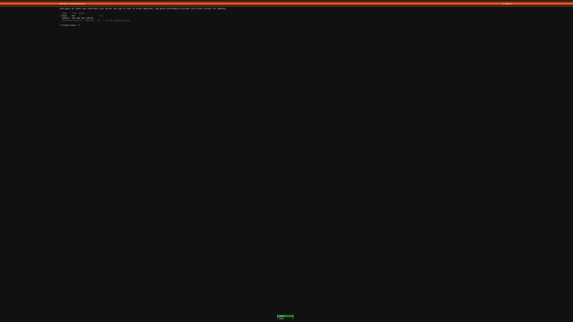](ubuntu-autoinstall-journey/step03-network.png) <sub>[text at 100%](ubuntu-autoinstall-journey/step03-network-crop.png)</sub>

### Step 4: accept the network screen

`network` leaves the list. Nothing is added: without a `network:` section the installer keeps what it detected (DHCP), which is what <kbd>Enter</kbd> does.

```yaml
#cloud-config
autoinstall:
  version: 1
  interactive-sections:
    - refresh-installer
    - proxy
    - apt
    - storage
    - identity
    - ubuntu-pro
    - ssh
    - drivers
    - snaps
  locale: en_US.UTF-8
  keyboard:
    layout: us
  source:
    id: ubuntu-server
    search_drivers: true
```

Removed: `- network`

**Outcome:** Stops on **Proxy configuration** with an empty proxy address.

[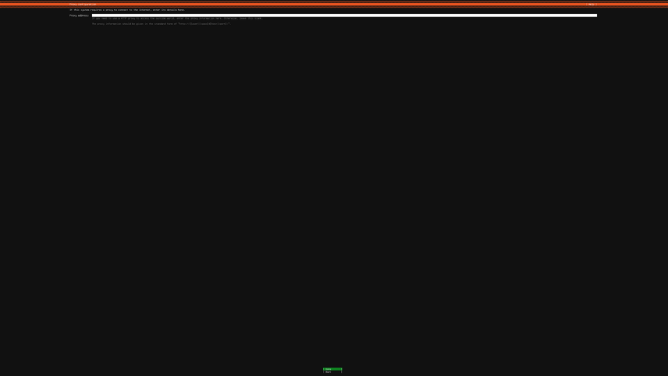](ubuntu-autoinstall-journey/step04-proxy.png) <sub>[text at 100%](ubuntu-autoinstall-journey/step04-proxy-crop.png)</sub>

### Step 5: accept the proxy screen

`proxy` leaves the list (no proxy is the default).

```yaml
#cloud-config
autoinstall:
  version: 1
  interactive-sections:
    - refresh-installer
    - apt
    - storage
    - identity
    - ubuntu-pro
    - ssh
    - drivers
    - snaps
  locale: en_US.UTF-8
  keyboard:
    layout: us
  source:
    id: ubuntu-server
    search_drivers: true
```

Removed: `- proxy`

**Outcome:** The next screen should be the archive mirror (`apt` is still listed), but the installer skips it: a short *Checking for installer update...*, then **Guided storage configuration**: `(X) Use an entire disk` (`/dev/vda`, 20 GiB) and `[X] Set up this disk as an LVM group`. Why the mirror screen never shows is explained at step 9.

[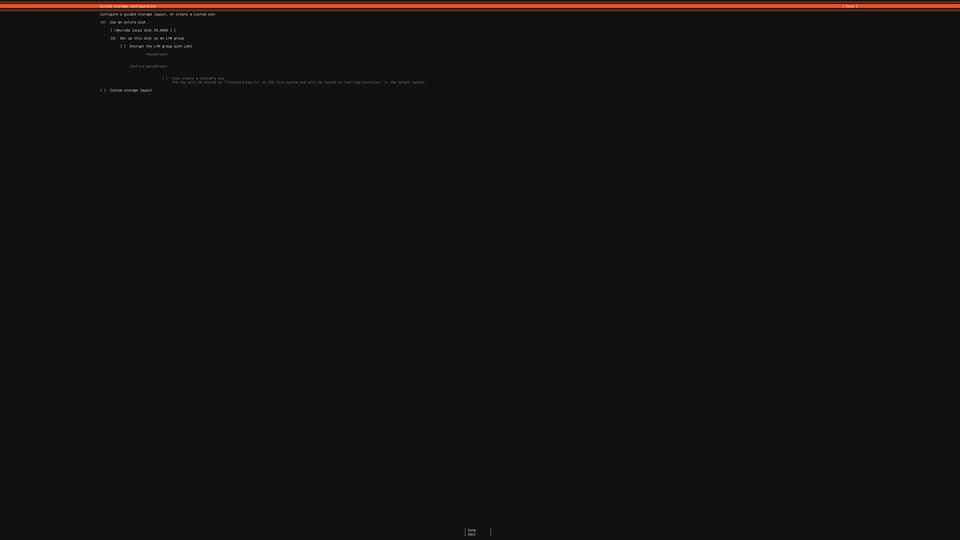](ubuntu-autoinstall-journey/step05-storage.png) <sub>[text at 100%](ubuntu-autoinstall-journey/step05-storage-crop.png)</sub>

### Step 6: answer the storage screen (whole disk, no LVM)

`storage` leaves the list. The answer is **not** the default: the whole disk without LVM is the layout `direct` (the default, `lvm`, is the ticked LVM box).

```yaml
#cloud-config
autoinstall:
  version: 1
  interactive-sections:
    - refresh-installer
    - apt
    - identity
    - ubuntu-pro
    - ssh
    - drivers
    - snaps
  locale: en_US.UTF-8
  keyboard:
    layout: us
  source:
    id: ubuntu-server
    search_drivers: true
  storage:                # <- added
    layout:               # <- added
      name: direct        # <- added
```

Removed: `- storage`

**Outcome:** Stops on **Profile configuration** (your name, server name, user name, password). No *Confirm destructive action* dialog: with `storage` answered, the installer does not ask.

[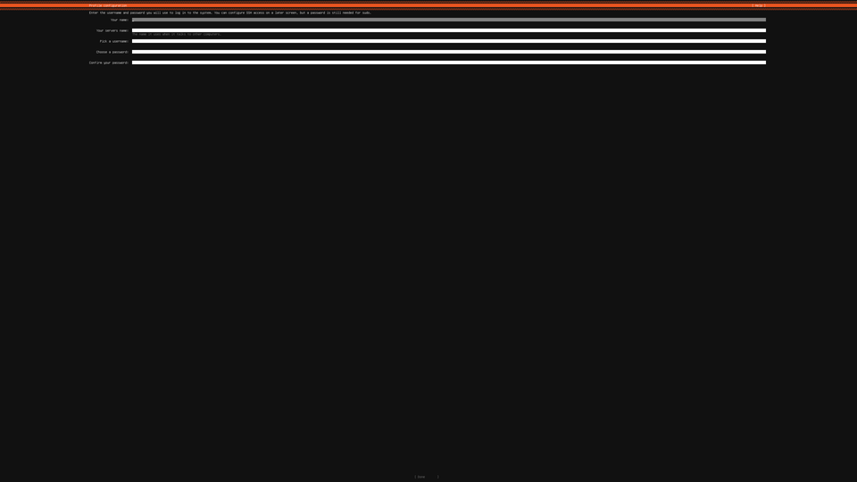](ubuntu-autoinstall-journey/step06-profile.png) <sub>[text at 100%](ubuntu-autoinstall-journey/step06-profile-crop.png)</sub>

### Step 7: answer the profile screen

`identity` leaves the list. Server name and user name `ubuntu`; the password `ubuntu|123` as a SHA-512 crypt hash (`openssl passwd -6 'ubuntu|123'`; the page shortens it, the full value is [in the final file](#the-final-minimal-answer-file)).

```yaml
#cloud-config
autoinstall:
  version: 1
  interactive-sections:
    - refresh-installer
    - apt
    - ubuntu-pro
    - ssh
    - drivers
    - snaps
  locale: en_US.UTF-8
  keyboard:
    layout: us
  source:
    id: ubuntu-server
    search_drivers: true
  storage:
    layout:
      name: direct
  identity:                                       # <- added
    hostname: ubuntu                              # <- added
    username: ubuntu                              # <- added
    password: "$6$BF.Fs1UgP/jTRJ.w$X0SB...ier20"  # <- added
```

Removed: `- identity`

**Outcome:** Stops on **Upgrade to Ubuntu Pro**: `( ) Enable Ubuntu Pro`, `(X) Skip for now`.

[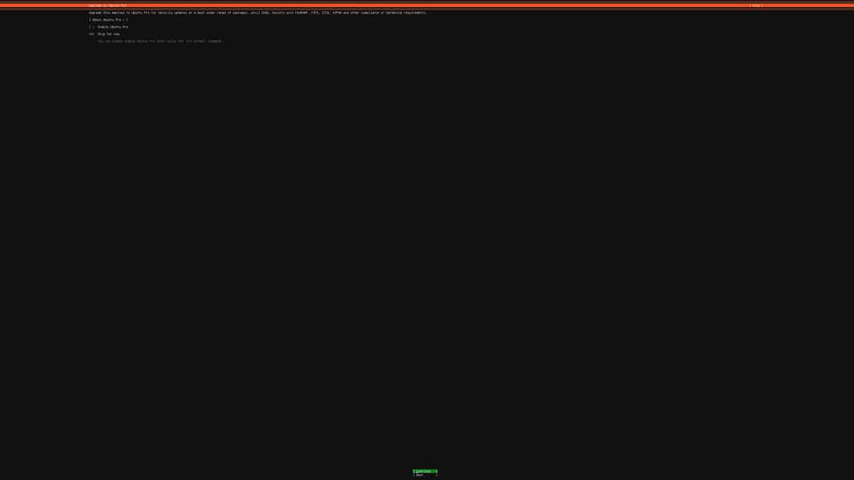](ubuntu-autoinstall-journey/step07-ubuntu-pro.png) <sub>[text at 100%](ubuntu-autoinstall-journey/step07-ubuntu-pro-crop.png)</sub>

### Step 8: accept the Ubuntu Pro screen

`ubuntu-pro` leaves the list (skip is the default).

```yaml
#cloud-config
autoinstall:
  version: 1
  interactive-sections:
    - refresh-installer
    - apt
    - ssh
    - drivers
    - snaps
  locale: en_US.UTF-8
  keyboard:
    layout: us
  source:
    id: ubuntu-server
    search_drivers: true
  storage:
    layout:
      name: direct
  identity:
    hostname: ubuntu
    username: ubuntu
    password: "$6$BF.Fs1UgP/jTRJ.w$X0SB...ier20"
```

Removed: `- ubuntu-pro`

**Outcome:** Stops on **SSH configuration**: `[ ] Install OpenSSH server` (not ticked), `[X] Allow password authentication over SSH` (greyed out until the server is ticked), no keys.

[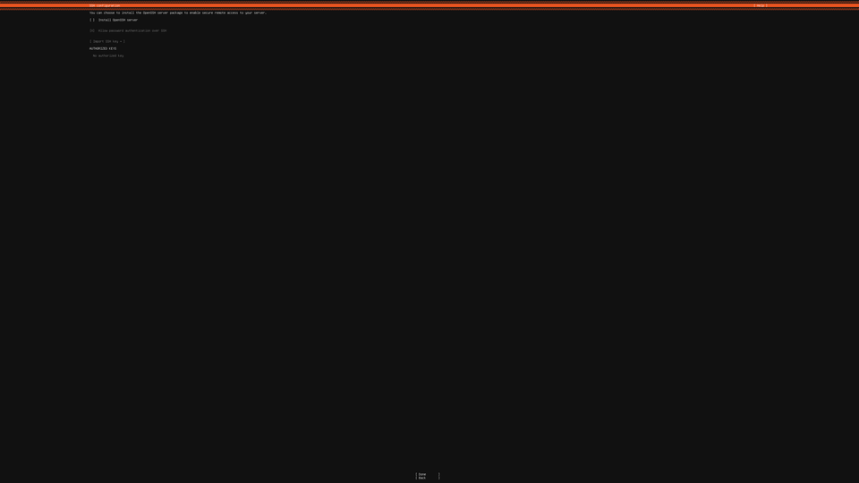](ubuntu-autoinstall-journey/step08-ssh.png) <sub>[text at 100%](ubuntu-autoinstall-journey/step08-ssh-crop.png)</sub>

### Step 9: answer the SSH screen

`ssh` leaves the list; `install-server: true` ticks the box. Password authentication is left alone: the screen shows it ticked, and the file's default (`allow-pw`) is true when no `authorized-keys` are given.

```yaml
#cloud-config
autoinstall:
  version: 1
  interactive-sections:
    - refresh-installer
    - apt
    - drivers
    - snaps
  locale: en_US.UTF-8
  keyboard:
    layout: us
  source:
    id: ubuntu-server
    search_drivers: true
  storage:
    layout:
      name: direct
  identity:
    hostname: ubuntu
    username: ubuntu
    password: "$6$BF.Fs1UgP/jTRJ.w$X0SB...ier20"
  ssh:                                            # <- added
    install-server: true                          # <- added
```

Removed: `- ssh`

**Outcome:** Stops on **Third-party drivers**: *Looking for applicable third-party drivers available locally or online...*, a spinner that does not end (watched for 13 minutes). The installer's logs (read through its shell, <kbd>F2</kbd>) show why. The install has not started: it still waits for the mirror (`apt`) answer, because the mirror screen was skipped at step 5. While it builds that screen, the installer's front end asks whether there is a network; `network` is no longer listed, so the back end answers that request with "skip this screen" and the mirror screen is skipped, but the back end still counts `apt` as unanswered. The driver search waits for the archive setup, and that never comes. So the mirror screen cannot be reached in this mode, and its default is taken next.

[](ubuntu-autoinstall-journey/step09-drivers-waiting.png) <sub>[text at 100%](ubuntu-autoinstall-journey/step09-drivers-waiting-crop.png)</sub>

### Step 10: accept the mirror (never shown)

`apt` leaves the list (the default archive mirror).

```yaml
#cloud-config
autoinstall:
  version: 1
  interactive-sections:
    - refresh-installer
    - drivers
    - snaps
  locale: en_US.UTF-8
  keyboard:
    layout: us
  source:
    id: ubuntu-server
    search_drivers: true
  storage:
    layout:
      name: direct
  identity:
    hostname: ubuntu
    username: ubuntu
    password: "$6$BF.Fs1UgP/jTRJ.w$X0SB...ier20"
  ssh:
    install-server: true
```

Removed: `- apt`

**Outcome:** The same spinner, for a second reason (again watched for 13 minutes). Now every install section is set (the log says the mirror is configured and nothing is left to wait for), but the driver search still waits for the archive setup, which runs only after the user confirms the install (*Confirm destructive action*). In an interactive session that question comes on the progress screen, after the Drivers and Snaps screens, so the Drivers screen waits for a question that comes after it.

[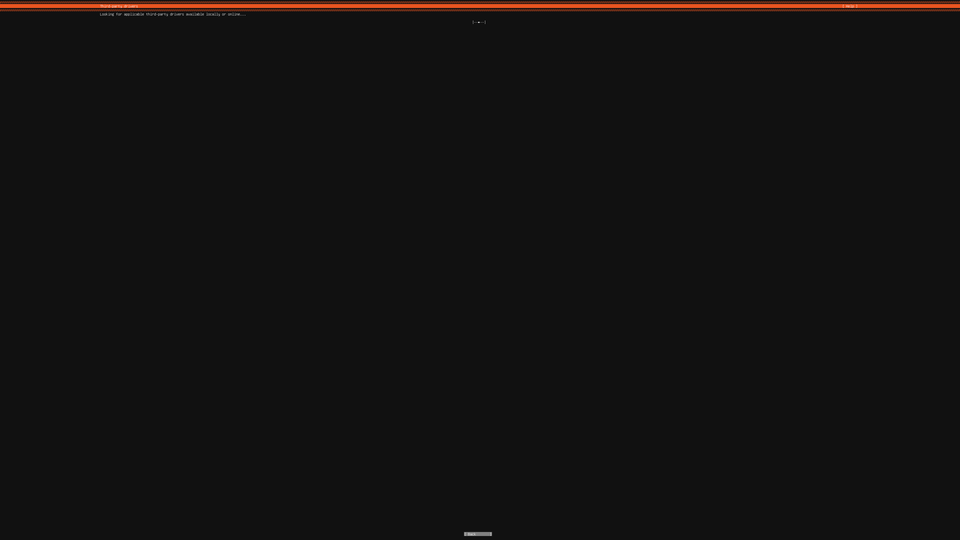](ubuntu-autoinstall-journey/step10-drivers-waiting.png) <sub>[text at 100%](ubuntu-autoinstall-journey/step10-drivers-waiting-crop.png)</sub>

### Step 11: accept the drivers screen (never shown)

`drivers` leaves the list (the default: install no third-party drivers; a VM has none).

```yaml
#cloud-config
autoinstall:
  version: 1
  interactive-sections:
    - refresh-installer
    - snaps
  locale: en_US.UTF-8
  keyboard:
    layout: us
  source:
    id: ubuntu-server
    search_drivers: true
  storage:
    layout:
      name: direct
  identity:
    hostname: ubuntu
    username: ubuntu
    password: "$6$BF.Fs1UgP/jTRJ.w$X0SB...ier20"
  ssh:
    install-server: true
```

Removed: `- drivers`

**Outcome:** Stops on **Featured server snaps**: microk8s, nextcloud, ..., lxd, none ticked.

[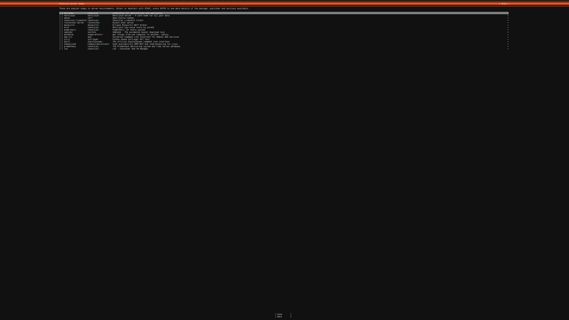](ubuntu-autoinstall-journey/step11-snaps.png) <sub>[text at 100%](ubuntu-autoinstall-journey/step11-snaps-crop.png)</sub>

### Step 12: accept the snaps screen

`snaps` leaves the list: nothing ticked, the default. Only `refresh-installer` is left; its screen shows only when a newer installer exists, and none did on any boot.

```yaml
#cloud-config
autoinstall:
  version: 1
  interactive-sections:
    - refresh-installer
  locale: en_US.UTF-8
  keyboard:
    layout: us
  source:
    id: ubuntu-server
    search_drivers: true
  storage:
    layout:
      name: direct
  identity:
    hostname: ubuntu
    username: ubuntu
    password: "$6$BF.Fs1UgP/jTRJ.w$X0SB...ier20"
  ssh:
    install-server: true
```

Removed: `- snaps`

**Outcome:** The installer moves to its progress screen, **Installing system**, with the dialog **Confirm destructive action** (*Selecting Continue below will begin the installation process and result in the loss of data on the disks selected to be formatted.*) and `[ No ]` focused, so here <kbd>Enter</kbd> would *not* continue. No entry in the file answers this dialog while the install is interactive.

[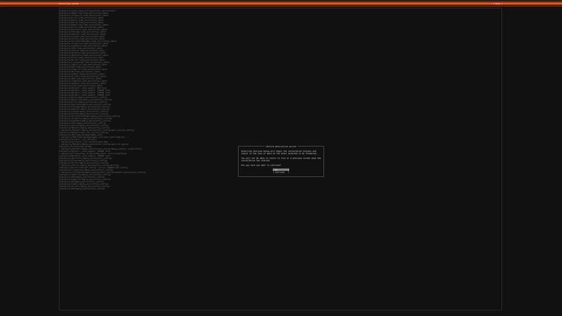](ubuntu-autoinstall-journey/step12-confirm.png) <sub>[text at 100%](ubuntu-autoinstall-journey/step12-confirm-crop.png)</sub>

### Step 13: no screens left: drop interactive-sections

With nothing left to ask, `interactive-sections` goes. The install is now unattended, and the `autoinstall` kernel argument confirms it (next section).

```yaml
#cloud-config
autoinstall:
  version: 1
  locale: en_US.UTF-8
  keyboard:
    layout: us
  source:
    id: ubuntu-server
    search_drivers: true
  storage:
    layout:
      name: direct
  identity:
    hostname: ubuntu
    username: ubuntu
    password: "$6$BF.Fs1UgP/jTRJ.w$X0SB...ier20"
  ssh:
    install-server: true
```

Removed: `interactive-sections:`, `- refresh-installer`

**Outcome:** **The install runs to the end with no question**: 7 minutes 45 seconds from power-on until the installer reboots (*reboot: Restarting system*; QEMU exits because it runs with `-no-reboot`). The last screenshot is the unattended progress log on the console: installing openssh-server, then security updates.

[](ubuntu-autoinstall-journey/step13-done.png) <sub>[text at 100%](ubuntu-autoinstall-journey/step13-done-crop.png)</sub>

## The "Continue with autoinstall?" question

One more question is not a screen and has no entry in the file. Step 13's
file, booted **without** the `autoinstall` kernel argument
(`console=ttyS0,115200 ip=dhcp netboot=nfs nfsroot={{.NFSRoot}} fsck.mode=skip ds=nocloud;s={{.ProvisionAutomationBaseURL}}/ ---`):

**Outcome:** the installer reads the file, sets everything up, and before it
touches the disk stops on the console:

```
Confirmation is required to continue.
Add 'autoinstall' to your kernel command line to avoid this

Continue with autoinstall? (yes|no)
```

[](ubuntu-autoinstall-journey/confirm-no-autoinstall-arg.png) <sub>[text at 100%](ubuntu-autoinstall-journey/confirm-no-autoinstall-arg-crop.png)</sub>

It is the unattended form of step 12's *Confirm destructive action*. The
answer is the kernel argument `autoinstall`, which isoboot's Ubuntu examples
always pass; it is a change to the BootConfig's `kernelArgs`, not a line of
the answer file.

## The final minimal answer file

Step 13's file still restates defaults. Taking out every entry that only
says what the installer does anyway leaves this:

```yaml
#cloud-config
autoinstall:
  version: 1
  storage:
    layout:
      name: direct
  identity:
    hostname: ubuntu
    username: ubuntu
    password: "$6$BF.Fs1UgP/jTRJ.w$X0SB/uSBGmj4ZmyqcAQgRMk52YDSi.ug6t.MDRjnMO6QreQjq2CCU8VzmX.oZrBKwbnN6pZ4.IrKlz6yiier20"
  ssh:
    install-server: true
```

(the hash is `openssl passwd -6 'ubuntu|123'`; any SHA-512 crypt of the same
password works.)

Dropped as defaults, each checked on the installed system or in the
installer's source:

| Entry | Default without it | Seen on the installed system |
|---|---|---|
| `locale: en_US.UTF-8` | `en_US.UTF-8` | `/etc/default/locale`: `LANG=en_US.UTF-8` |
| `keyboard: {layout: us}` | `us` | `/etc/default/keyboard`: `XKBLAYOUT="us"` |
| `source: {id: ubuntu-server, search_drivers: true}` | Ubuntu Server; driver search on | |
| (no `network:`) | DHCP on the detected NIC | address from DHCP on `ens3` |
| (no `proxy:`, `apt:`) | no proxy, the default archive mirror | |
| (no `drivers:`) | `install: false` | |
| (no `snaps:`) | none | `snap list`: `core24`, `snapd`, `hwctl`, none of them chosen |
| (no `ubuntu-pro:`) | skip | |
| `interactive-sections` | none: the install is unattended | |

It installs Ubuntu 26.04.1 unattended in 7 minutes 47 seconds (power-on to the
installer's reboot) onto the whole disk without LVM:

```
$ lsblk -o NAME,TYPE,FSTYPE,SIZE,MOUNTPOINTS
NAME   TYPE FSTYPE    SIZE MOUNTPOINTS
vda    disk            20G
├─vda1 part vfat      953M /boot/efi
└─vda2 part ext4     19.1G /
```

and the user `ubuntu` logs in with `ubuntu|123` on the console and over SSH
(the server offers `publickey,password`; the login used password
authentication only):

[](ubuntu-autoinstall-journey/login2604-1-prompt.png) <sub>[text at 100%](ubuntu-autoinstall-journey/login2604-1-prompt-crop.png)</sub>
[](ubuntu-autoinstall-journey/login2604-2-shell.png) <sub>[text at 100%](ubuntu-autoinstall-journey/login2604-2-shell-crop.png)</sub>

## Every line is needed: ablation

Each boot below used the minimal file with one line removed (a fresh disk,
the same kernel arguments); the last two remove a whole entry. Removing a key
line also changes what the lines under it mean, so the outcome is that of
the whole remaining file. Every removal breaks something: the install stops
with an error, never starts, or finishes without what was asked for. (The three
boots that install had to be repeated: the test host's internet link kept
dropping, and the first tries stalled while the installer fetched from the
Ubuntu archive, at the mirror check, the kernel download or the security
updates. The table shows the boots that ran through.)

| Line | Removed | Outcome | Screen |
|---|---|---|---|
| 1 | `#cloud-config` | The **language screen**: without the header cloud-init does not read the user-data as cloud-config, so there is no answer file. | <a href="ubuntu-autoinstall-journey/ablate-01.png"></a> <sub><a href="ubuntu-autoinstall-journey/ablate-01-crop.png">text at 100%</a></sub> |
| 2 | `autoinstall:` | *An error occurred. Press enter to start a shell*. Serial log: *'identity' is valid autoinstall but not found under 'autoinstall'.* (the same for `storage`), *Misplaced autoinstall directives resulted in a cloud-init schema validation failure.* | <a href="ubuntu-autoinstall-journey/ablate-02.png"></a> <sub><a href="ubuntu-autoinstall-journey/ablate-02-crop.png">text at 100%</a></sub> |
| 3 | `version: 1` | *An error occurred...*; *Malformed autoinstall in 'version or interactive-sections' section*: `version` is required. | <a href="ubuntu-autoinstall-journey/ablate-03.png"></a> <sub><a href="ubuntu-autoinstall-journey/ablate-03-crop.png">text at 100%</a></sub> |
| 4 | `storage:` | The **language screen**: `layout:` is then indented under `version: 1`, the file is not valid YAML, and cloud-init ignores it. | <a href="ubuntu-autoinstall-journey/ablate-04.png"></a> <sub><a href="ubuntu-autoinstall-journey/ablate-04-crop.png">text at 100%</a></sub> |
| 5 | `layout:` | *An error occurred...*; *autoinstall config did not mount root*: `storage: {name: direct}` is read as a storage config with no file systems. | <a href="ubuntu-autoinstall-journey/ablate-05.png"></a> <sub><a href="ubuntu-autoinstall-journey/ablate-05-crop.png">text at 100%</a></sub> |
| 6 | `name: direct` | *An error occurred...*; *'NoneType' object is not subscriptable*: an empty `layout:`. | <a href="ubuntu-autoinstall-journey/ablate-06.png"></a> <sub><a href="ubuntu-autoinstall-journey/ablate-06-crop.png">text at 100%</a></sub> |
| 7 | `identity:` | *An error occurred...*; *neither identity nor user-data provided*: the user lines now belong to `storage`, and there is no user. | <a href="ubuntu-autoinstall-journey/ablate-07.png"></a> <sub><a href="ubuntu-autoinstall-journey/ablate-07-crop.png">text at 100%</a></sub> |
| 8 | `hostname: ubuntu` | *An error occurred...*; *Malformed autoinstall in 'identity' section*: `hostname`, `username` and `password` are all required. | <a href="ubuntu-autoinstall-journey/ablate-08.png"></a> <sub><a href="ubuntu-autoinstall-journey/ablate-08-crop.png">text at 100%</a></sub> |
| 9 | `username: ubuntu` | The same: *Malformed autoinstall in 'identity' section*. | <a href="ubuntu-autoinstall-journey/ablate-09.png"></a> <sub><a href="ubuntu-autoinstall-journey/ablate-09-crop.png">text at 100%</a></sub> |
| 10 | `password: ...` | The same: *Malformed autoinstall in 'identity' section*. | <a href="ubuntu-autoinstall-journey/ablate-10.png"></a> <sub><a href="ubuntu-autoinstall-journey/ablate-10-crop.png">text at 100%</a></sub> |
| 11 | `ssh:` | The same: `install-server: true` then belongs to `identity`, which allows no such key. | <a href="ubuntu-autoinstall-journey/ablate-11.png"></a> <sub><a href="ubuntu-autoinstall-journey/ablate-11-crop.png">text at 100%</a></sub> |
| 12 | `install-server: true` | The install **finishes** (8 minutes) but without an SSH server: an empty `ssh:` means the default, no server. `systemctl is-enabled ssh.socket`: `not-found`; port 22 refuses connections. | <a href="ubuntu-autoinstall-journey/ablate-12.png"></a> <sub><a href="ubuntu-autoinstall-journey/ablate-12-crop.png">text at 100%</a></sub> |
| 4-6 | the whole `storage:` entry | The install **finishes** (11 minutes), but with the default layout, LVM: `vda3` `LVM2_member` with `ubuntu--vg-ubuntu--lv` as `/` (10 GiB of the 17.3 GiB volume group), plus a separate 1.8 GiB `/boot`. Needed for "whole disk, no LVM". | <a href="ubuntu-autoinstall-journey/ablate-storage.png"></a> <sub><a href="ubuntu-autoinstall-journey/ablate-storage-crop.png">text at 100%</a></sub> |
| 11-12 | the whole `ssh:` entry | The install **finishes** (12 minutes), whole disk without LVM, user `ubuntu` logs in on the console, but there is no SSH server: `systemctl is-enabled ssh.socket` says `not-found` and port 22 refuses connections; `lsblk` shows the same layout as the minimal file (<a href="ubuntu-autoinstall-journey/ablate-ssh-lsblk.png"></a>). Needed for the SSH requirement. | <a href="ubuntu-autoinstall-journey/ablate-ssh-socket.png"></a> <sub><a href="ubuntu-autoinstall-journey/ablate-ssh-socket-crop.png">text at 100%</a></sub> |

## systemctl get-default: 24.04 and 26.04

The same minimal file installed Ubuntu 24.04.5 LTS too (BootConfig
`ubuntu-24.04`, its own ISO; 6 minutes 3 seconds to the reboot). On both, logged in
as `ubuntu` on the console and over SSH:

| | Ubuntu 24.04.5 LTS | Ubuntu 26.04.1 LTS |
|---|---|---|
| `systemctl get-default` | **`graphical.target`** | **`graphical.target`** |
| `systemctl is-active graphical.target multi-user.target` | `active`, `active` | `active`, `active` |
| display manager (`gdm3`, `lightdm`, `sddm`), Xorg, Xwayland | none installed | none installed |
| `display-manager.service` | no such unit | no such unit |
| `/usr/share/xsessions`, `/usr/share/wayland-sessions` | absent | absent |
| `/etc/systemd/system/default.target` (the admin's choice) | absent | absent |
| `/usr/lib/systemd/system/default.target` (systemd's default) | `-> graphical.target` | `-> graphical.target` |
| snaps after install | none | `core24`, `snapd`, `hwctl` |

[](ubuntu-autoinstall-journey/login2404-3-get-default.png) <sub>[text at 100%](ubuntu-autoinstall-journey/login2404-3-get-default-crop.png)</sub>
[](ubuntu-autoinstall-journey/login2604-3-get-default.png) <sub>[text at 100%](ubuntu-autoinstall-journey/login2604-3-get-default-crop.png)</sub>
[](ubuntu-autoinstall-journey/login2404-4-os-release.png) <sub>[text at 100%](ubuntu-autoinstall-journey/login2404-4-os-release-crop.png)</sub>
[](ubuntu-autoinstall-journey/login2604-4-os-release.png) <sub>[text at 100%](ubuntu-autoinstall-journey/login2604-4-os-release-crop.png)</sub>
[](ubuntu-autoinstall-journey/login2404-1-prompt.png) <sub>[text at 100%](ubuntu-autoinstall-journey/login2404-1-prompt-crop.png)</sub>
[](ubuntu-autoinstall-journey/login2404-2-shell.png) <sub>[text at 100%](ubuntu-autoinstall-journey/login2404-2-shell-crop.png)</sub>

So both answer `graphical.target`, and neither is a GUI. `default.target`
is the unit systemd starts at boot; `multi-user.target` means "everything
for a multi-user system with network and services, text logins only", and
`graphical.target` is `multi-user.target` **plus** a graphical login
(`display-manager.service`). On these servers no display manager is
installed, so reaching `graphical.target` adds nothing: the machine boots to
the same text console as with `multi-user.target`, and both targets are
active. Nothing in the server install sets `default.target`, so systemd's
own default, `graphical.target`, stands. `sudo systemctl set-default
multi-user.target` would make the name match what the server does; it
changes nothing else.

## The 4K screen

The E2E's QEMU machine (`qemu_start` in
[`test/e2e/provision/lib.sh`](../test/e2e/provision/lib.sh)) has a standard
VGA card whose EDID offers 3840x2160 as the preferred mode, with 64 MiB of
video memory (one 4K frame at 32 bits per pixel needs about 32 MiB):

```
-vga none -device VGA,xres=3840,yres=2160,edid=on,vgamem_mb=64 -display none -vnc 127.0.0.1:0
```

The guest kernel first draws on the firmware framebuffer (`simpledrm`), then
`bochs-drm` takes over: *[drm] Found bochs VGA, ID 0xb0c5.*, *[drm]
Framebuffer size 65536 kB*, *fbcon: bochs-drmdrmfb (fb0) is primary device*.
Every screenshot here is a 3840x2160 PNG from QEMU's `screendump ... -f png`,
and the installed system reports `3840,2160` in
`/sys/class/graphics/fb0/virtual_size` (24.04.5 the same):

[](ubuntu-autoinstall-journey/login2604-5-fb-size.png) <sub>[text at 100%](ubuntu-autoinstall-journey/login2604-5-fb-size-crop.png)</sub>
[](ubuntu-autoinstall-journey/login2404-5-fb-size.png) <sub>[text at 100%](ubuntu-autoinstall-journey/login2404-5-fb-size-crop.png)</sub>

Only firmware and iPXE screens are smaller (1280x800); none is shown here.

The text is small at 4K: subiquity loads its own 8x16 console font
(`setfont $SNAP/subiquity.psf` in its start script), so a kernel font
argument such as `fbcon=font:TER16x32` would not reach the installer's
screens; the screenshots use no font argument. Next to every thumbnail,
*text at 100%* links a crop of the screen at its real pixel size.

## How to reproduce

The harness is [`hack/autoinstall-journey.sh`](../hack/autoinstall-journey.sh).
It runs where the provision E2E runs, after the E2E phases up to an applied
Ubuntu BootConfig, for example in the local E2E VM made by
[`hack/e2e-local.sh`](../hack/e2e-local.sh):

```sh
# inside the E2E VM, after: ~/isoboot/test/e2e/provision/run.sh ubuntu-26.04 apply-row
args='console=ttyS0,115200 ip=dhcp netboot=nfs nfsroot={{.NFSRoot}} fsck.mode=skip autoinstall ds=nocloud;s={{.ProvisionAutomationBaseURL}}/ ---'
: > meta-data
~/isoboot/hack/autoinstall-journey.sh install out/step07 \
  --kernel-args "$args" --user-data step07.yaml --meta-data meta-data --minutes 25
# when an install finished (QEMU exited): log in on the console and over SSH
~/isoboot/hack/autoinstall-journey.sh login out/step07 --user ubuntu --password 'ubuntu|123' \
  --command 'systemctl get-default' --ssh-command 'systemctl get-default'
```

Each `install` boots a fresh blank 20 GiB disk, sets the BootConfig's kernel
arguments and the ProvisionAutomation's files, resets the Provision to
`Pending`, and follows the screen (a PNG every 20 s) until QEMU exits (the
installer rebooted; QEMU runs with `-no-reboot`), the screen stops changing
for 3 minutes (a question or an error; `--stable-minutes` changes that, and
10 or more keeps a slow package download from being taken for a stop), or
`--minutes` pass. It keeps
`final.png`, `serial.log`, `kernel-args.txt`, the served files and this
boot's nginx requests in the output directory. `--bootconfig ubuntu-24.04`
picks another release.

To watch a boot live, tunnel the VNC port (it listens on 127.0.0.1 only;
`E2E_VNC_DISPLAY=:1` moves it to 5901):

```sh
# from your workstation, through the host that runs the E2E VM
ssh -J you@host -L 5900:127.0.0.1:5900 ubuntu@<e2e-vm-ip>
# then point a VNC viewer at localhost:5900
```

## What surprised us

- **One entry turns every screen off.** As soon as the user-data has an
  `autoinstall:` section, subiquity stops asking and needs a user; "answer
  one screen and keep the others" only works with `interactive-sections`.
- **A partly interactive install can hang for good.** With `network`
  answered but `apt` still interactive, the mirror screen is skipped yet still
  waited for (step 9). With every install section answered but `drivers`
  still interactive, the Drivers screen waits for an install confirmation
  that is only asked after it (step 10). Both show the same endless
  *Looking for applicable third-party drivers...* spinner, and nothing on the
  screen says why; the reason is only in `/var/log/installer`.
- **The mirror screen never appeared** in any boot of this page, although
  `apt` was listed in `interactive-sections`.
- **Enter does not always mean yes.** On *Confirm destructive action*
  (step 12) the focused button is `[ No ]`.
- **Without the `autoinstall` kernel argument** a complete answer file still
  stops at *Continue with autoinstall? (yes|no)*.
- **Preseed works, but on the live system only.** `locale=` changes the
  language screen's language and preselection, and a keyboard preseed sets
  the console keyboard, but neither removes a screen.
- **`systemctl get-default` says `graphical.target`** on both 24.04.5 and
  26.04.1 servers, which have no display manager at all.
- **26.04.1 installs snaps nobody asked for** (`core24`, `snapd` and
  `hwctl`), with the snaps screen left at "nothing ticked"; 24.04.5 installs
  none.
- **The whole install is fast over NFS**: about 6 to 8 minutes from power-on
  to reboot with 2 GiB of RAM, the ISO tree read over NFS and packages from
  the Ubuntu archive (when the archive is reachable; when it was not, the
  installer waited without a word for over 10 minutes).
- **The 4K text is tiny.** subiquity sets its own 8x16 console font, so a
  kernel font argument would not help its screens.

## Appendix: writing the file top-down instead

A first attempt built the file from the top, one line per boot, without
`interactive-sections`. It shows what each structural line does on its own
(same kernel arguments as the journey, with `autoinstall`):

| File | Outcome |
|---|---|
| `#cloud-config` only | The language screen: a cloud-config without an `autoinstall:` section is not an answer file. |
| `+ autoinstall:` (empty) | *An error occurred. Press enter to start a shell* right after subiquity reads the file. The empty key is YAML `null`, not a section. |
| `+   version: 1` | *An error occurred. Press enter to start a shell*; the serial log says *neither identity nor user-data provided*. An answer file makes the install unattended, and the user has no default. |
| `+   identity:` (empty) | The same error: an empty `identity` is no user. |

[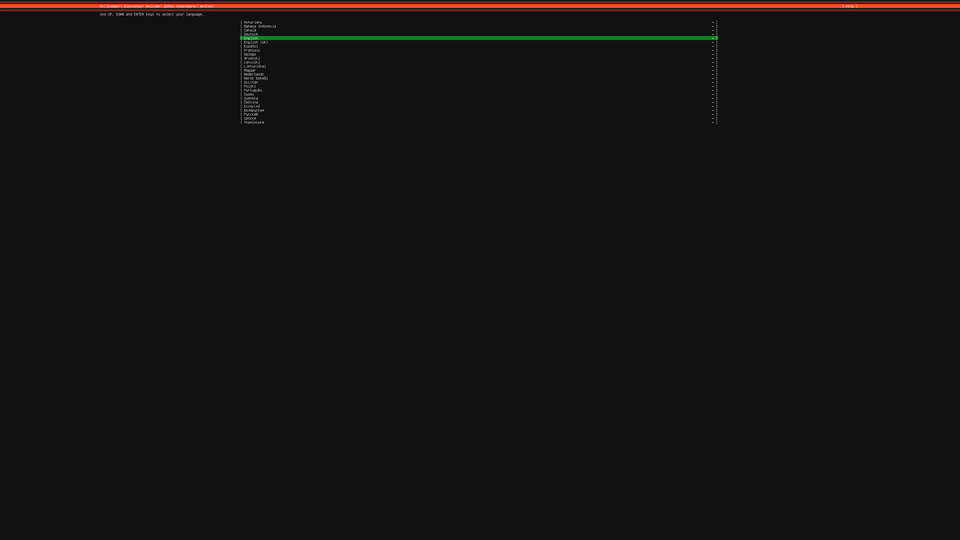](ubuntu-autoinstall-journey/topdown01-cloud-config.png) <sub>[text at 100%](ubuntu-autoinstall-journey/topdown01-cloud-config-crop.png)</sub>
[](ubuntu-autoinstall-journey/topdown02-autoinstall.png) <sub>[text at 100%](ubuntu-autoinstall-journey/topdown02-autoinstall-crop.png)</sub>
[](ubuntu-autoinstall-journey/topdown03-version.png) <sub>[text at 100%](ubuntu-autoinstall-journey/topdown03-version-crop.png)</sub>
[](ubuntu-autoinstall-journey/topdown04-identity.png) <sub>[text at 100%](ubuntu-autoinstall-journey/topdown04-identity-crop.png)</sub>

This is why the journey above starts with `interactive-sections`: without
it, the first entry of an answer file already turns every other screen off,
and the install needs the user before it can show anything.
